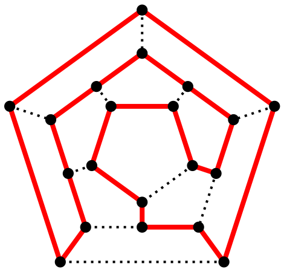

# 图数据结构

## 图基本算法

* adjacent(G, x, y): tests whether there is an edge from the vertex x to the vertex y;
* neighbors(G, x): lists all vertices y such that there is an edge from the vertex x to the vertex y;
* add_vertex(G, x): adds the vertex x, if it is not there;
* remove_vertex(G, x): removes the vertex x, if it is there;
* add_edge(G, x, y): adds the edge from the vertex x to the vertex y, if it is not there;
* remove_edge(G, x, y): removes the edge from the vertex x to the vertex y, if it is there;
* get_vertex_value(G, x): returns the value associated with the vertex x;
* set_vertex_value(G, x, v): sets the value associated with the vertex x to v;

如果是加权图,边也需要提供方法获取/设置值

* get_edge_value(G, x, y): returns the value associated with the edge (x, y);
* set_edge_value(G, x, y, v): sets the value associated with the edge (x, y) to v.

## 图的表示形式

### 邻接矩阵

最常用的图表示方法为邻接矩阵

无向图(Vertex共有4个):

```table
┌─────────┬──────────┬──────────┬──────────┬──────────┐
│         │    0     │    1     │    2     │    3     │
├─────────┼──────────┼──────────┼──────────┼──────────┤
│    0    │ Infinity │    0     │ Infinity │ Infinity │
│    1    │    0     │ Infinity │    0     │    0     │
│    2    │ Infinity │    0     │ Infinity │    0     │
│    3    │ Infinity │    0     │    0     │ Infinity │
└─────────┴──────────┴──────────┴──────────┴──────────┘
```

有向加权图(Vertex共有4个):

```table
┌─────────┬──────────┬──────────┬──────────┬──────────┐
│         │    0     │    1     │    2     │    3     │
├─────────┼──────────┼──────────┼──────────┼──────────┤
│    0    │ Infinity │    2     │ Infinity │ Infinity │
│    1    │ Infinity │ Infinity │    1     │    7     │
│    2    │ Infinity │ Infinity │ Infinity │    5     │
│    3    │ Infinity │ Infinity │ Infinity │ Infinity │
└─────────┴──────────┴──────────┴──────────┴──────────┘
```

### 邻接列表

另外一种表示方式为邻接列表,每个节点都有一个连接到它的所有节点的列表集合,可以使用包含节点的Array(或HashMap)作为邻接列表的数据结构,每个节点条目列出其相邻节点的列表(可以通过Array,LinkedList,Set等进行存储)

同时节点还可以列出其边的列表方便访问与遍历.

[实现源码](../src/graph/Graph.js)

## 图的遍历

图的遍历与树的遍历类似,可以使用深度优先和广度优先两种策略.

### DFS

深度优先搜索算法是一种用于遍历或搜索树或图的算法.沿着树的深度遍历树的节点,尽可能深的搜索树的分支.当节点v的所在边都己被探寻过,搜索将回溯到发现节点v的那条边的起始节点.这一过程一直进行到已发现从源节点可达的所有节点为止.如果还存在未被发现的节点,则选择其中一个作为源节点并重复以上过程,整个进程反复进行直到所有节点都被访问为止.

[实现源码](../src/graph/depthFirstSearch.js)

### BFS

广度优先搜索算法是一种图形搜索算法.简单的说,BFS是从开始节点开始,沿着树/图的宽度遍历节点.如果所有节点均被访问,则算法中止.广度优先搜索的实现一般采用open-closed表.

实现方法:

1. 首先将开始节点放入队列中.
2. 从队列中取出第一个节点,并检验它是否需要遍历该节点.
3. 如果否,则跳转到步骤2.
4. 否则将它所有尚未检验过的直接子节点加入队列中.
5. 若队列为空,表示整张图都检查过了,算法结束.
6. 重复步骤2.

[实现源码](../src/graph/breadthFirstSearch.js)

## 最小生成树

最小生成树是连通加权无向图中一棵权值最小的生成树,主要可以使用Prim和Kruskal算法实现,对于稀疏图来说,用Kruskal写最小生成树效率更好,加上并查集,可对其进行优化

### kruskal

输入: 一个加权连通图`G`,其中顶点集合为`V`,边集合为`E`

初始化: 新建图`G'`:拥有原图中相同的节点,但没有边.将原图中所有的边`E`按权值从小到大排序组成`Esort`

遍历`Esort`(`for (u, v) of Esort`) :

如果边`(u, v)`连接的两个节点`u, v`于图`G'`中不在同一个连通分量,则添加`(u, v)`到图`G'`

输出: 使用集合`G'`来描述所得到的最小生成树

`u, v`于图`G'`中不在同一个连通分量可以使用 `DisJoinSet` 实现.

[实现源码](../src/graph/kruskal.js)

### prim

输入: 一个加权连通图`G`,其中顶点集合为`V`,边集合为`E`

初始化: 顶点集合 `Unew = {x}`,其中`x`为集合`V`中的任一节点(起始点)

重复下列操作,直到`Unew = V`:

1. 在集合`Unew`顶点集关联的所有的边中,选取权值最小的边`(u, v)`,其中u为集合`Unew`中的元素,而`v`则是`V`中没有加入`Unew`的顶点(如果存在有多条满足前述条件即具有相同权值的边,则可任意选取其中之一)
2. 将`v`加入集合`Unew`中

输出: 使用集合`Unew`和`Enew`来描述所得到的最小生成树

[实现源码](../src/graph/prim.js)

Prim算法求最小生成树的时候和边数无关,和顶点树有关,所以适合求解稠密网的最小生成树.

## 最短路径

最短路径问题是图论研究中的一个经典算法问题,旨在寻找图(由结点和路径组成的)中两结点之间的最短路径.算法具体的形式包括:

全源最短路径问题: 求图中所有顶点之间的最短路径.适合使用基于动态规划的Floyd-Warshall算法.

单源最短路径问题: 适合使用Dijkstra算法.

另外

### Floyd Warshall

Floyd-Warshall 原理是动态规划.动态转移方程为:

```js
shortestPath(i,j,k) = Min(
shortestPath(i,j,k-1),
shortestPath(i,k,k-1)+shortestPath(k,j,k-1))
```

```Pseudocode
FloydWarshall(vertices, edges)
let dist = [|V|][|V|] and minimum distances initialized to INFINITY
for each edge(u,v) in edges
    dist[u][v] := w(u,v)  // the weight of the edge (u,v)
for each v in vertices
    dist[v][v] := 0
for k from 1 to |V|
    for i from 1 to |V|
       for j from 1 to |V|
          if (dist[i][j] > dist[i][k] + dist[k][j]) then
             dist[i][j] := dist[i][k] + dist[k][j]
```

[实现源码](../src/graph/floydWarshall.js)

### Dijkstra

迪杰斯特拉算法主要特点是以起始点为中心向外层层扩展,直到扩展所有可遍历点为止,每次扩散都选择距离起始点最短的点.同时访问过的点不再访问.控制访问过的点不再访问,可以通过维护 OPEN CLOSE 表等方式.

扩展以松弛操作为基础,即估计的最短路径值渐渐地被更加准确的值替代,直至得到最优解

```Pseudocode
Dijkstra(vertices, edges, source)
  for each vertex v in vertices
    dist[v] := INFINITY
    prev[v] := UNDEFINED
    add v to Q
  dist[source] := 0
  while Q is not empty
    u := vertex in Q with min dist[u]
    remove u from Q // 从Q中移除,也可以达到OPEN 列表的效果.
    for each neighbor v of u
      alt := dist[u] + weight(u, v)
      if (alt < dist[v]) then
        dist[v] := alt
        prev[v] := u
  return dist[], prev[]
```

Dijkstra算法最简单的实现方法是用一个链表或者数组来存储可遍历顶点的集合 `Q`,所以搜索 `Q`中最小元素的运算只需要线性搜索Q中的所有元素.这样的话算法的运行时间是 `O(n^2)`.

对于边数少于 `n^2` 的稀疏图来说,我们可以用邻接表更有效的实现该算法.

同时将将一个二叉堆或者斐波纳契堆用作优先队列来查找最小的顶点.当用到二叉堆的时候,算法所需的时间为 `O((m+n)logn)`,斐波纳契堆能稍微提高一些性能,让算法运行时间达到 `O(m+nlogn)`.然而,使用斐波纳契堆常常会由于算法常数过大而导致速度没有显著提高.

[实现源码](../src/graph/dijkstra.js)

由于Dijkstra采用的是贪心算法,无法考虑远处的负权边,因此无法解决负权问题.

举例说明

```js
// 邻接矩阵:代表点 0 1 2 构成的有向图,计算从0出发的距离
[[0,3,4]
[Inf,0,-2]
[Inf,Inf,0]]
```

根据Dijkstra 算法, 遍历 `0` 的邻居`1`时,会选择 `dist[1]=3` 而不会考虑 `dist[1]=4+(-2)`.这就是 Dijkstra 的局限性.

### Bellman Ford

与Dijkstra算法类似 BF也是以松弛操作为基础.

然而对于松弛操作`Dijkstra`以贪心法选取未被处理的具有最小权值的节点,然后对其的出边进行松弛操作,而`Bellman-Ford`算法简单地对所有边进行松弛操作,共 `|V|-1` 次,其中 `|V|` 是图的点的数量.在重复地计算中,已计算得到正确的距离的边的数量不断增加,直到所有边都计算得到了正确的路径.

```Pseudocode
BellmanFord(vertices, edges, source)  
  // This implementation takes in a graph, represented as
  // lists of vertices and edges, and fills two arrays
  // (dist and prev) about the shortest path
  // from the source to each vertex
  // Step 1: initialize graph
  for each vertex v in vertices
    dist[v] := INFINITY             // Initialize the dist to all vertices to infinity
    prev[v] := UNDEFINED         // And having a null prev
  dist[source] := 0              // The dist from the source to itself is, of course, zero
  // Step 2: relax edges repeatedly
  for i from 1 to size(vertices)-1
    for each u in vertices
      for each edge (u, v) with weight w in edges of u
        if (dist[u] + w < dist[v]) then
          dist[v] := dist[u] + w
          prev[v] := u
  // Step 3: check for negative-weight cycles
  for each edge (u, v) with weight w in edges
    if (dist[u] + w < dist[v]) then
      error "Graph contains a negative-weight cycle"
  return dist[], prev[]
```

[实现源码](../src/graph/bellmanFord.js)

Bellman Ford虽然解决可负权的问题但是还是会引发另外问题问题,考虑如下无向图:

```js
// 邻接矩阵:代表点 0 1 2 构成的无向图,计算从0出发的距离
[[0,3,4]
[3,0,-2]
[4,-2,0]]
```

更新  `dist[1] = dist[2] + (-2)` 后又会引发更新 `dist[2] = dist[1] + -2` 这就是 `Graph contains a negative-weight cycle`问题,需要检查处理.

### SPFA

Bellman-Ford算法的改进版本,遍历时不再是无脑的选取任意顶点,而是选取当前路径最短的节点,会一定程度上降低复杂度.

但是还是需要考虑负权环的问题.

```Pseudocode
ShortestPathFaster(vertices, edges, s)
  for each vertex v in vertices
    dist(v) := INFINITY
    prev[v] := UNDEFINED
  dist(s) := 0
  add s into Q
  while Q is not empty
    u := poll Q
    for each edge (u, v) with weight w in edges of u
      if dist(u) + w < dist(v) then
        dist(v) := dist(u) + w
        prev[v] := u
        if v is not in Q then
          add v into Q
 ```

[实现源码](../src/graph/spfa.js)

### A*

这是一种在图形平面上,有多个节点的路径,求出最低通过成本的算法.常用于游戏中的NPC的移动计算,或网络游戏的BOT的移动计算上.

该算法综合了最良优先搜索和`Dijkstra`算法的优点:在进行启发式搜索提高算法效率的同时,可以保证找到一条最优路径(基于评估函数).

在此算法中:,如果以`g(n)`表示从起点到任意顶点`n`的实际距离,`h(n)`表示任意顶点`n`到目标顶点的估算距离(根据所采用的评估函数的不同而变化),那么A*算法的估算函数为:

`f(n)=g(n)+h(n)`

[实现源码](../src/graph/astar.js)

## 其他图的问题

### 桥和割点算法(bridge,cut vertex)

#### 割点

在一个无向图中.如果有一个顶点集合.删除这个顶点集合以及这个集合中所有顶点相关联的边以后.图的连通分量增多.就称这个点集为割点集合.

可以使用Tarjan算法求割点:

首先对于一个节点u 如果符合下面两个属性之一则为割点:

1. 根节点,并且有2棵即以上的子树.
2. 非根节点,`u`的孩子中存在节点`v`,除了通过父子边(回边),无法回溯到`u`的祖先.

使用DFS顺序遍历,通过给每个节点一个访问时间,如果一个节点(`current`)的`neighbors`中存在深度遍历过程中父节点(`previous`)的祖先节点,说明即时去掉`previous`,`current`也能通过`previous.parent`与所有访问时间靠前的节点联通,即`previous`不是割点,反之,`previous`为割点.

通过归纳法思想,可以通过这个算法可以得到割点.


[实现源码](../src/graph/articulationPoints.js)

#### 桥

求图的桥的算法与割点算法类似,也是通过判断节点再不通过`(current,previous)`这个 Edge 情况下,是否能到达比previous时间还早的节点.

同时需要注意的是深度遍历过程中,需要记得更新previous的`lowDiscoveryTime`

[实现源码](../src/graph/graphBridges.js)

### 强连通分量

强连通图指每一个顶点皆可以经由该图上的边抵达其他的每一个点的有向图

强连通分量则是指一张有向图G的极大强连通子图G'

Kosaraju算法,Tarjan算法,Gabow算法皆为寻找有向图强连通分量的有效算法.但是由于在Tarjan算法和Gabow算法的过程中,只需要进行一次的深度优先搜索,因而相对Kosaraju算法较有效率.


#### Kosaraju

1. 对有向图得到反向图
2. 对反向图按照深度优先遍历的将节点逆序放入堆栈
3. 弹出堆栈中节点作为初始节点,在有向图中进行深度优先搜索(深度优先遍历时,需要记录已经遍历过的节点,防止重复遍历.)
4. 同一个深度优先搜索中访问的所有顶点都在同一个强连通分量内

#### Tarjan

任选一节点开始进行深度优先搜索(若深度优先搜索结束后仍有未访问的节点,则再从中任选一点再次进行).搜索过程中已访问的节点不再访问.搜索树的若干子树构成了图的强连通分量.

1. 节点按照深度优先遍历顺序存入堆栈中.然后继续DFS其子树.
2. DFS子树返回时,将其从堆栈中删除,并检查该节点是否是某一强连通分量的根节点(`发现时间等于最早发现的前继节点的发现时间`)
3. 如果某节点是强连通分量的根,则在它之前出堆栈且还不属于其他强连通分量的节点构成了该节点所在的强连通分量.

[实现源码](../src/graph/stronglyConnectedComponents.js)

### 拓扑排序

在一个有向图中,对所有的节点进行排序,要求任意一个节点都排在他的前继节点之后.

拓扑排序经常使用在作业调度解决作业依赖问题.

实现逻辑很简单,DFS即可

[实现源码](../src/graph/topologicalSort.js)

### 检测图中的环

[实现源码](../src/graph/detectCycle.js)

### 欧拉路径

一笔画问题(`Eulerian Graph`)是图论中一个著名的问题.一笔画问题起源于柯尼斯堡七桥问题.数学家欧拉在他1736年发表的论文'柯尼斯堡的七桥'中不仅解决了七桥问题,也提出了一笔画定理,顺带解决了一笔画问题.一般认为,欧拉的研究是图论的开端.

* 连通的无向图G有欧拉路径的充要条件是: G中奇顶点的数目等于0或者2
* 连通的无向图G是欧拉环的充要条件是: G中每个顶点的度都是偶数

对于一个有欧拉路径或者欧拉环的无向图,获取欧拉路径的方法为:

1. 取图中中一个点x,Path.push(x)
2. 选择x的边i(除非只有桥边否则选择非桥边),删除i,然后x设置为i的另一个定点y
3. 如果图中还有边,继续执行算法.

[实现源码](../src/graph/eulerianPath.js)

### 哈密顿图

通过图G的每个结点一次,且仅一次的通路,就是哈密顿通路.存在哈密顿回路的图就是哈密顿图.



哈密尔顿图的充分条件: 对于顶点个数大于2的图,如果图中任意两点度的和大于或等于顶点总数,那这个图一定是哈密顿图.

闭合的哈密顿路径称作哈密顿圈,含有图中所有顶点的路径称作哈密顿路径.

[实现源码](../src/graph/hamiltonianPath.js)