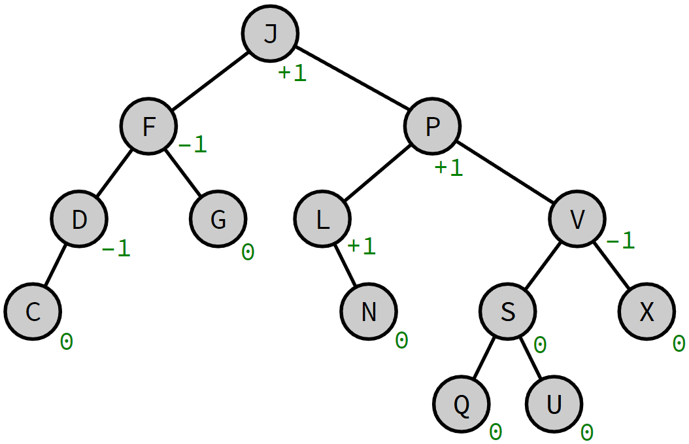
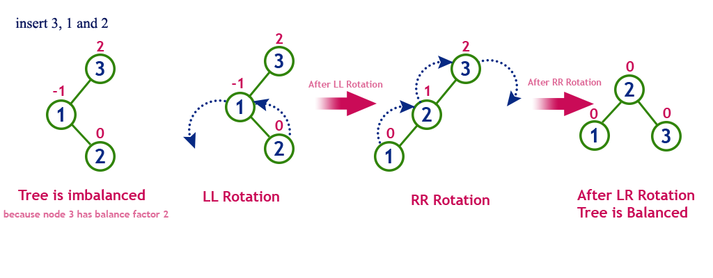
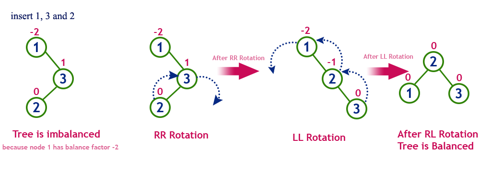

# AVL树

AVL(Adelson-Velsky-Landis)树是最先发明的自平衡二叉查找树,在AVL树中任何节点的两个子树的高度最大差别为1,所以它也被称为高度平衡树

## 平衡因子

AVL树通过定义平衡因子来表示一个节点是否平衡,平衡因子定义为左子树高度减去右子树高度.

## 旋转

如果平衡因子绝对值大于1,需要通过旋转操作来.主要的旋转操作有如下几个:

### Left-Left Rotation

### Right-Right Rotation

### Left-Right Rotation

### Right-Left Rotation

