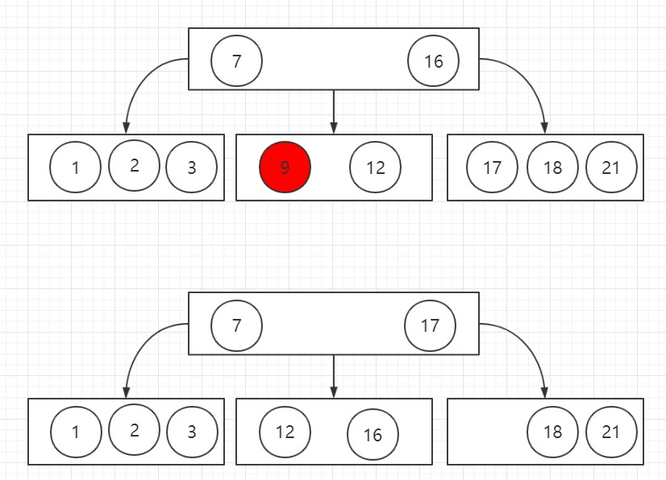
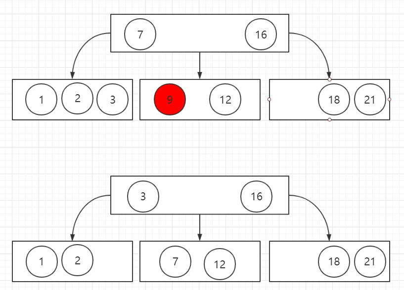
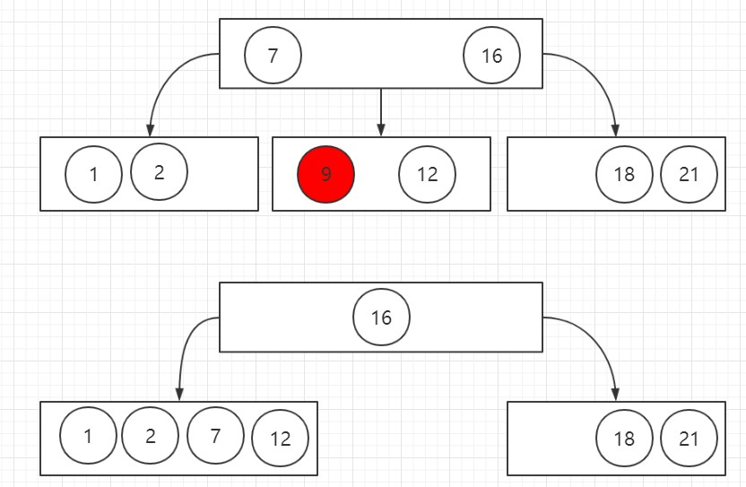

# B Tree

B树(B-tree)是一种自平衡的树,能够保持数据有序.这种数据结构能够让查找数据、顺序访问、插入数据及删除的动作,都在对数时间内完成.B树,概括来说是一个一般化的二叉查找树(**binary search tree**)一个节点可以拥有最少2个子节点.与自平衡二叉查找树不同,B树适用于读写相对大的数据块的存储系统,例如磁盘.B树减少定位记录时所经历的中间过程,从而加快存取速度.B树这种数据结构可以用来描述外部存储.这种数据结构常被应用在数据库和文件系统的实现上.

一个 `m` 阶的B树是一个有以下属性的树:

1. 每一个节点最多有 `m` 个子节点
2. 每一个非叶子节点(除根节点)最少有 `⌈m/2⌉` 个子节点
3. 如果根节点不是叶子节点那么它至少有两个子节点
4. 有 `k` 个子节点的非叶子节点拥有 `k − 1` 个键值
5. 所有的叶子节点都在同一层

常见的是 2-3-4 B树(4阶B树)

* 2-节点,就是说,它包含 1 个元素和 2 个儿子
* 3-节点,就是说,它包含 2 个元素和 3 个儿子
* 4-节点,就是说,它包含 3 个元素和 4 个儿子

## 变种

* Ｂ+树:
  * 每一个节点最多有 `m` 个子节点
  * 每一个非叶子节点(除根节点)最少有 `⌈m/2⌉` 个子节点
  * 有 `k` 个子节点的节点包含有 `k` 个键值(BTree 是 `k-1`)
  * 根节点和内部结点中不保存数据,只用于索引,所有键值和数据都保存在叶子节点中(BTree 中根节点和内部结点既用于索引也用于存储键值和数据)
  * 一个叶子节点可以包含一个指针,指向另一个叶子节点以加速顺序存取
* B*树: 分支出更多的内部邻居节点以保持内部节点更密集地填充.此变体要求非根节点至少`2/3`填充,而不是`1/2`.

## 操作

### 搜索

B树的搜索和二叉搜索树类似.从根节点开始,从上到下递归的遍历树.在每一层上,搜索的范围被减小到包含了搜索值的子树中.子树值的范围被它的父节点的键确定.

### 插入

所有的插入都从根节点开始.要插入一个新的元素,首先搜索这棵树找到新元素应该被添加到的叶子节点.

* 如果节点拥有的元素数量小于最大值,那么有空间容纳新的元素.将新元素插入到这一节点,且保持节点中元素有序.
* 否则的话这一节点已经满了,将它平均地分裂成两个节点：
  1. 从叶子节点的元素和新的元素中选择出中位数
  2. 小于这一中位数的元素放入左边节点,大于这一中位数的元素放入右边节点,中位数作为分隔值.
  3. 分隔值被插入到父节点中,这可能会造成父节点分裂,分裂父节点时可能又会使它的父节点分裂,以此类推.如果没有父节点(这一节点是根节点),就创建一个新的根节点(增加了树的高度).如果分裂一直上升到根节点,那么一个新的根节点会被创建,它有一个分隔值和两个子节点.这就是根节点并不像内部节点一样有最少子节点数量限制的原因.

### 删除

删除一个元素时有以下两种特殊情况:

* 这个元素用于分隔一个内部节点的子节点
* 删除元素会导致它所在的节点或子节点元素的数量小于最低值(下溢出)

#### 删除叶子节点中的元素

1. 搜索要删除的元素
2. 如果它在叶子节点,将它从中删除
3. 如果发生了下溢出,按照[删除后重新平衡](#删除后重新平衡)重新调整树

#### 删除内部节点中的元素

1. 搜索要删除的元素
2. 如果它在内部节点中,将它从中删除
3. 内部节点中的每一个元素都作为分隔两颗子树的分隔值,因此需要重新划分
   1. 选择一个新的分隔符(左子树中最大的元素或右子树中最小的元素,都在叶子节点中),用于替换被删除的元素作为新的分隔值.
   2. 将这个已经移动内部结点的元素从叶子节点中移除([重新平衡](#重新平衡))

#### 重新平衡

重新平衡从叶子节点开始向根节点进行,直到树重新平衡: 如果删除节点中的一个元素使该节点的元素数量低于最小值那么一些元素必须被重新分配.

* 如果缺少元素节点的右兄弟存在且拥有多余的元素,那么向左旋转
  1. 将父节点的分隔值复制到缺少元素节点的最后
  2. 将父节点的分隔值替换为右兄弟的第一个元素
  3. 树重新平衡

例如下图中 删除 9

* 否则,如果缺少元素节点的左兄弟存在且拥有多余的元素,那么向右旋转
  1. 将父节点的分隔值复制到缺少元素节点的开始
  2. 将父节点的分隔值替换为左兄弟的最后一个元素
  3. 树重新平衡

例如下图中 删除 9

* 否则,如果它的两个直接兄弟节点都只有最小数量的元素,那么将它与一个直接兄弟节点以及父节点中它们的分隔值合并
  1. 将分隔值复制到左边的节点(左边的节点可以是缺少元素的节点或者拥有最小数量元素的兄弟节点)
  2. 将右边节点中所有的元素移动到左边节点(左边节点现在拥有最大数量的元素,右边节点为空)
  3. 将父节点中的分隔值和空的右子树移除(父节点失去了一个元素)
  4. 如果父节点是根节点,
     1. 如果根节点没有元素了(说明之前只有一个元素及分割点),那么释放它并且让合并之后的节点成为新的根节点(树的深度减小)
     2. 否则算法结束
  5. 否则如果父节点不是根节点,
     1. 如果父节点的元素数量小于最小值,递归调用本算法继续重新平衡父节点
     2. 否则算法结束

## RTree 实现

[RTree](../src/tree/BTree.js)