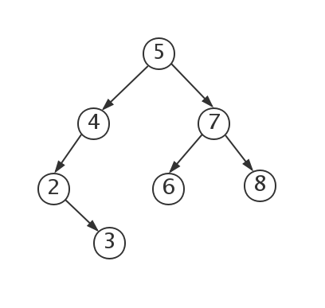
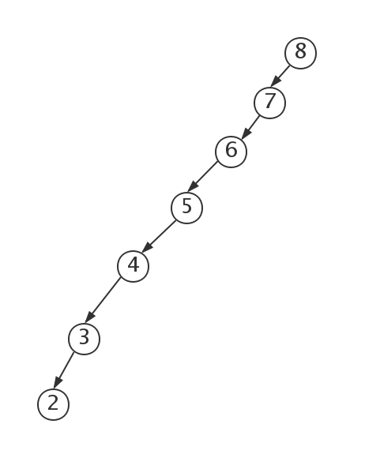
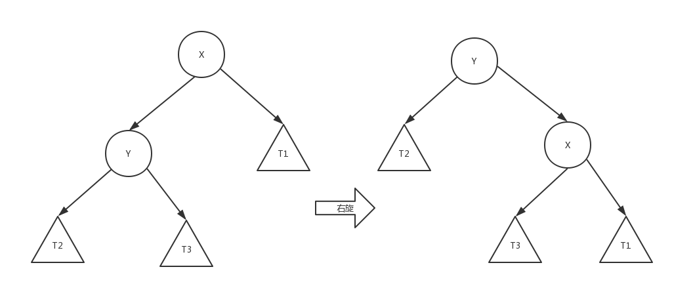
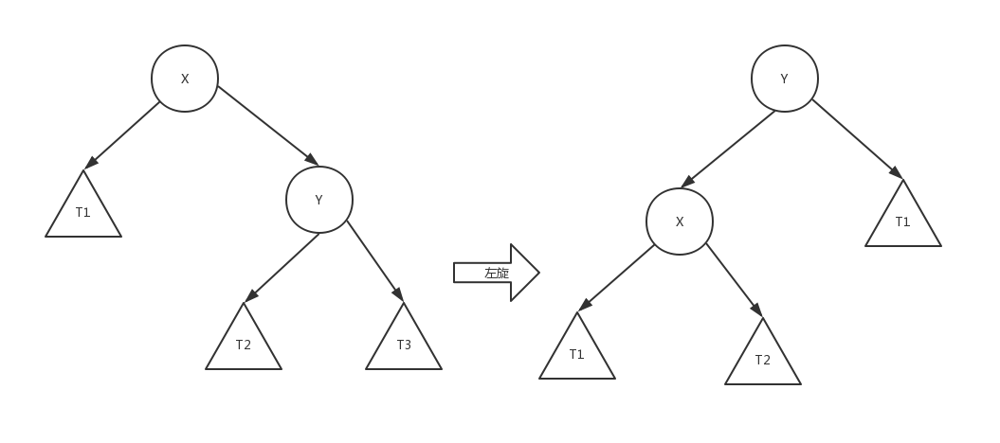

# 二叉查找树

二叉查找树或者是一棵空树,或者是具有下列性质的二叉树:

1. 若左子树不空,则左子树上所有结点的值均小于它的根结点的值
2. 若右子树不空,则右子树上所有结点的值均大于它的根结点的值
3. 左,右子树也分别为二叉排序树
4. 没有键值相等的节点。



BST树的操作主要要 查以及增删.其复杂度为 O(log(n)).

二叉查找树存在的一个问题是 : 如果insert的值的序列是递增or递减的,树会严重左偏或者右偏,甚至退化为线性查找.



因此需要在插入或删除时对二叉树不断的进行平衡,使其左右子树高度接近.

## 左旋和右旋

在二叉搜索树中,左旋和右旋是相当普遍而重要的操作.红黑树,AVL树,Splay树,Treap等等一系列自平衡的二叉搜索树都会利用旋转操作维持一定程度的平衡,同时不破坏二叉树基本性质.



```js
/**
 * 节点右旋
 * @param {BinaryTreeNode} node
 */
function _rotateRight(node) {
  let nodeLeft = node._left;
  let nodeLeftRight = node._left._right;
  _setLeft(node, null);
  _replace(node, nodeLeft);
  _setRight(nodeLeft, node);
  _setLeft(node, nodeLeftRight);
  return nodeLeft;
}
```



```js
/**
 * 节点左旋
 * @param {BinaryTreeNode} node
 */
function _rotateLeft(node) {
  let nodeRight = node._right;
  let nodeRightLeft = node._right._left;
  _setRight(node, null);
  _replace(node, nodeRight);
  _setLeft(nodeRight, node);
  _setRight(node, nodeRightLeft);
  return nodeRight;
}
```

## 实现

[Binary Search Tree Source Code](../src/tree/BinarySearchTree.js)