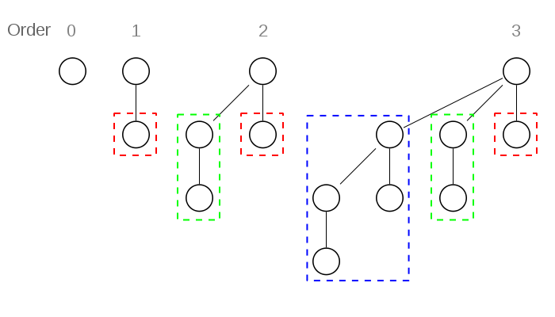
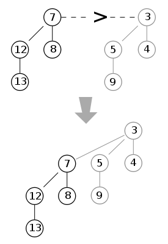
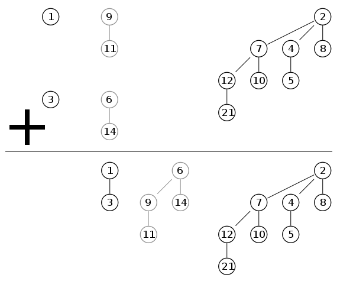

# 堆

## 二叉堆

二叉堆是一种特殊的堆,二叉堆是完全二元树(二叉树)或者是近似完全二元树(二叉树).

二叉堆有两种.最大堆和最小堆.最大堆:父结点的键值总是大于或等于任何一个子节点的键值,最小堆:父结点的键值总是小于或等于任何一个子节点的键值.

二叉堆一般用数组来表示.

### 插入节点

在数组的最末尾插入新节点,然后自下而上调整子节点与父节点(**heapify-up**).

### 删除根节点

把堆存储的最后那个节点移到填在根节点处,再从上而下调整父节点与它的子节点(**heapify-down**)

### 实现

[最大堆](../src/heap/MaxHeap.js)

[最小堆](../src/heap/MinHeap.js)

## 左倾堆

左倾堆的每个节点有一个附加信息,即`null path length(npl)`: 从一个节点到一个最近的不满节点的路径长度(不满节点:两个子节点至少有一个为NULL)

左倾堆是一个符合下面要求的二叉树:

1. 每个节点的Key大于(或小于)子节点的Key
2. 对于任意节点的左右两个子节点,右子节点的`npl`不大于左子节点的`npl`.

可以证明 如果一个左倾堆的右侧路径上有r个节点,那么该左倾堆将至少有2^r-1个节点,整个左倾堆至少有2^(r+1)-1个节点,因此如果沿着右侧路径合并,复杂度
为log(n).

左倾堆合并算法:

1. 如果一个空左倾堆与一个非空左倾堆合并,返回非空左倾堆
2. 如果两个左倾堆都非空,那么比较两个根节点的value.取较小的根节点为新的根节点,合并较小根节点堆的右子堆与较大根节点堆.
3. 如果右子堆npl > 左子堆npl,互换右子堆与左子堆.
4. 更新根节点的npl = 右子堆npl + 1


### LeftistTree 实现

[LeftistTree](../src/heap/LeftistTree.js)

## 二项堆

二项堆是一系列二项树的集合,二项树定义如下:

### 二项树

二项树是递归的定义的:

1. 度为0的二项树只包含一个节点
2. 度为k的二项树有一个根节点,根节点有k个子女,每个子女分别是度数为k-1,k-2,……,2,1,0的二项树的根

二项树实现结构如下:

* 每个节点持有一个父节点指针
* 每个节点只有一个孩子指针,指向第一个孩子
* 每个节点有一个邻居指针,指向下一个邻居,通过孩子指针和孩子指针的邻居指针可以遍历所有的孩子.



二项堆是指满足以下性质的二项树的集合:

1. 每棵二项树都满足最小堆性质,即结点关键字大于等于其父结点的值
2. 不能有两棵或以上的二项树有相同度数(包括度数为0),换句话说,具有度数k的二项树有0个或1个.


### 合并

最基本的为二个度数相同的二项树的合并,由于二项树根结点包含最小的关键字,因此在二颗树合并时,只需比较二个根结点关键字的大小,其中含小关键字的结点成为结果树的根结点,另一棵树则变成结果树的子树

```js
function mergeTree(p, q)
    if p.root <= q.root
        return p.addSubTree(q)
    else
        return q.addSubTree(p)
```



两个二项堆的合并则可按如下步骤进行:度数 j从小取到大,在两个二项堆中如果其中只有一棵树的度数为 j,即将此树移动到结果堆,而如果只两棵树的度数都为 j,则根据以上方法合并为一个度数为 j+1 的二项树.此后这个度数为 j+1 的树将可能会和其他度数为 j+1 的二项树进行合并.因此,对于任何度数j,可能最多需要合并3棵二项树.

此操作的时间复杂度为 O(log n).

```js
function merge(p, q)
    while not (p.end() and q.end())
        tree = mergeTree(p.currentTree(), q.currentTree())
        if not heap.currentTree().empty()
            tree = mergeTree(tree, heap.currentTree())
        heap.addTree(tree)
        heap.next(); p.next(); q.next()
```



### 插入

创建一个只包含要插入元素的二项堆,再将此堆与原先的二项堆进行合并,即可得到插入后的堆.由于需要合并,插入操作需要O(logn)的时间.平摊分析的时间复杂度为O(1)

### 查找最小关键字所在结点

由于满足最小堆性质,只需查找二项树的的根结点即可

### 删除最小关键字所在结点

先找到最小关键字所在结点,然后将它从其所在的二项树中删除,并获得其子树,将这些子树看作一个独立的二项堆,再将此堆合并到原先的堆中即可

```js
function deleteMin(heap)
    min = heap.trees().first()
    for each current in heap.trees()
        if current.root < min then min = current
    for each tree in min.subTrees()
        tmp.addTree(tree)
    heap.removeTree(min)
    merge(heap, tmp)
```

### 减小特定结点(关键字)的值

在减小特定结点(关键字)的值后,可能会不满足最小堆积性质.此时,将其所在结点与父结点交换,如还不满足最小堆性质则再与祖父结点交换……直到最小堆性质得到满足.

### 删除节点

将需要删除的结点的关键字的值减小到负无穷大(比二项堆中的其他所有关键字的值都小即可),执行“减小关键字的值”算法,使其调整到当前二项树的根节点位置,再删除最小关键字的根结点即可

以下对于二项堆操作的运行时间都为 O(logn):

* 在二项堆中插入新结点
* 合并两个二项堆
* 查找最小关键字所在结点(可以通过维护最小关键字指针达到 O(1))
* 删除最小关键字所在结点
* 减小给定结点关键字的值
* 删除给定结点

### BinomialHeap 实现

[BinomialHeap](../src/heap/BinomialHeap.js)

## 斐波那契堆(Fibonacci Heap)

斐波那契堆是由一组最小堆有序树构成的集合,每个最小堆有序树的度数为其子节点的数目,树的度数为其根节点的度数.

斐波那契堆中所有树的根节点也用一个双向循环链表链接起来

使用一个指针指向斐波那契堆中最小元素

斐波那契堆 比二项堆有更好的平摊分析复杂度


斐波那契堆的主要操作有:

* 合并两个斐波那契堆(O(1)): 简单合并两个斐波纳契堆的根表.即把两个斐波纳契堆的所有树的根首尾衔接并置
* 在斐波那契堆中插入新结点(O(1)): 创建一个仅包含一个节点的新的斐波纳契堆,然后执行堆合并.
* 查找最小关键字所在结点(O(1)): 由于用一个指针指向了具有最小值的根节点,因此查找最小的节点是简单的操作.
* 删除最小关键字所在结点(平摊分析 O(log(n))): 查找最小的根节点并删除它,其所有的子节点都加入堆的根表,然后维护根表(维护根表: 然后对根表中当前包含的树的度数从低到高,迭代执行具有相同度数的树的合并并实现最小树化调整,使得堆包含的树具有不同的度数)
* 减小给定结点关键字的值(平摊分析 O(1)): 对一个节点的键值降低后,自键值降低的节点开始自下而上的迭代执行下述操作,直至到根节点或一个未被标记(marked)节点为止
  如果当前节点键值小于其父节点的键值,则把该节点及其子树摘下来作为堆的新树的根节点；其原父节点如果是被标记(marked)节点,则也被摘下来作为堆的新树的根节点；如果其原父节点不是被标记(marked)节点且不是根节点,则其原父节点被加标记.
* 删除给定结点(平摊分析 O(log(n))): 把被删除节点的键值调整为负无穷小，然后减小给定结点关键字的值，然后再删除最小关键字所在结点

### FibonacciHeap 实现

[FibonacciHeap](../src/heap/FibonacciHeap.js)

## 优先队列(Priority Queue)

普通的队列是一种先进先出的数据结构,元素在队列尾追加,而从队列头删除.在优先队列中,元素被赋予优先级.当访问元素时,具有最高优先级的元素最先删除.优先队列具有最高级先出(**first in, largest out**)的行为特征.通常采用堆(例如二项堆,斐波那契堆等)数据结构来实现.

## Reference

[binomial-heap/overview](https://www.growingwiththeweb.com/data-structures/binomial-heap/overview/)
[fibonacci-heap/overview](https://www.growingwiththeweb.com/data-structures/fibonacci-heap/overview/)
