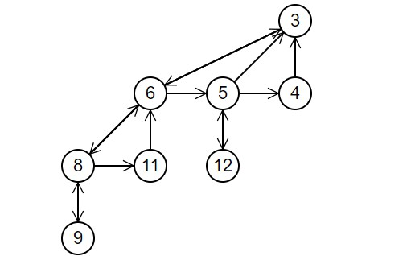

# 堆

## 二叉堆

二叉堆是一种特殊的堆,二叉堆是完全二元树(二叉树)或者是近似完全二元树(二叉树).

二叉堆有两种.最大堆和最小堆.最大堆:父结点的键值总是大于或等于任何一个子节点的键值,最小堆:父结点的键值总是小于或等于任何一个子节点的键值.

二叉堆一般用数组来表示.

### 插入节点

在数组的最末尾插入新节点,然后自下而上调整子节点与父节点(**bubble-up**).

### 删除根节点

把堆存储的最后那个节点移到填在根节点处,再从上而下调整父节点与它的子节点(**bubble-down**)

## 二项树

二项树是递归的定义的:

1. 度为0的二项树只包含一个节点
2. 度为k的二项树有一个根节点,根节点有k个子女,每个子女分别是度数为k-1,k-2,……,2,1的二项树的根

## 二项堆

二项堆是指满足以下性质的二项树的集合:

1. 每棵二项树都满足最小堆性质,即结点关键字大于等于其父结点的值
2. 不能有两棵或以上的二项树有相同度数(包括度数为0),换句话说,具有度数k的二项树有0个或1个.

### 合并

最基本的为二个度数相同的二项树的合并,由于二项树根结点包含最小的关键字,因此在二颗树合并时,只需比较二个根结点关键字的大小,其中含小关键字的结点成为结果树的根结点,另一棵树则变成结果树的子树

### 插入

创建一个只包含要插入元素的二项堆,再将此堆与原先的二项堆进行合并,即可得到插入后的堆.由于需要合并,插入操作需要O(logn)的时间.平摊分析的时间复杂度为O(1)

### 查找最小关键字所在结点

由于满足最小堆性质,只需查找二项树的的根结点即可

### 删除最小关键字所在结点

先找到最小关键字所在结点,然后将它从其所在的二项树中删除,并获得其子树,将这些子树看作一个独立的二项堆,再将此堆合并到原先的堆中即可

### 减小特定结点(关键字)的值

在减小特定结点(关键字)的值后,可能会不满足最小堆积性质.此时,将其所在结点与父结点交换,如还不满足最小堆性质则再与祖父结点交换……直到最小堆性质得到满足.

### 删除节点

将需要删除的结点的关键字的值减小到负无穷大(比二项堆中的其他所有关键字的值都小即可),执行“减小关键字的值”算法,使其调整到当前二项树的根节点位置,再删除最小关键字的根结点即可

## 左倾堆

左倾堆的每个节点有一个附加信息,即`null path length(npl)`: 从一个节点到一个最近的不满节点的路径长度(不满节点:两个子节点至少有一个为NULL)

左倾堆是一个符合下面要求的二叉树:

1. 每个节点的Key大于子节点的Key
2. 对于任意节点的左右两个子节点,右子节点的`npl`不大于左子节点的`npl`.

## 斐波那契堆(Fibonacci Heap)

斐波那契堆是一系列无序树的集合,每棵树是一个最小堆,满足最小堆的性质.堆保存了堆中所有节点的数目,保存了最小关键字的节点.

斐波那契堆中所有树的根节点也用一个双向循环链表链接起来

使用一个指针指向斐波那契堆中最小元素

## 优先队列(Priority Queue)

普通的队列是一种先进先出的数据结构,元素在队列尾追加,而从队列头删除.在优先队列中,元素被赋予优先级.当访问元素时,具有最高优先级的元素最先删除.优先队列具有最高级先出(**first in, largest out**)的行为特征.通常采用堆数据结构来实现.