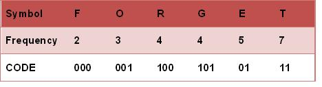

# 最优二叉树(Huffman Tree)

## 构造

赫夫曼树的构建步骤如下:

1. 将给定的n个权值看做n棵只有根节点(无左右孩子)的二叉树,组成一个集合HT,每棵树的权值为该节点的权值
2. 从集合HT中选出2棵权值最小的二叉树,组成一棵新的二叉树,其权值为这2棵二叉树的权值之和
3. 将步骤2中选出的2棵二叉树从集合HT中删去,同时将步骤2中新得到的二叉树加入到集合HT中
4. 重复步骤2和步骤3,直到集合HT中只含一棵树,这棵树便是赫夫曼树

## Huffman编码

在计算机数据处理中,霍夫曼编码使用变长编码表对源符号(如文件中的一个字母)进行编码,其中变长编码表是通过一种评估来源符号出现机率的方法得到的,出现机率高的字母使用较短的编码,反之出现机率低的则使用较长的编码,这便使编码之后的字符串的平均长度、期望值降低,从而达到无损压缩数据的目的.

建立Huffman 编码前,将源符号按照频率作为权值构建Huffman树

然后给霍夫曼树的所有左链接'0'与右链接'1',再从树根至树叶依序记录所有字母的编码

