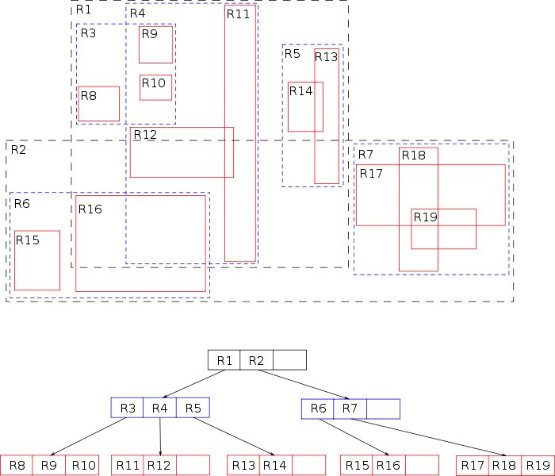

# R-Tree

R树是用来做空间数据存储的树状数据结构,在现实生活中R树可以用来存储地图上的空间信息,例如餐馆地址,或者地图上用来构造街道,建筑,湖泊边缘和海岸线的多边形.然后可以用它来回答"查找距离我2千米以内的博物馆","检索距离我2千米以内的所有路段"(然后显示在导航系统中)或者"查找(直线距离)最近的加油站"这类问题.

R树的核心思想是聚合距离相近的节点并在树结构的上一层将其表示为这些节点的最小外接矩形,这个最小外接矩形就成为上一层的一个节点

