# 红黑树(R-B Tree)

R-B Tree,全称是Red-Black Tree,又称为"红黑树",它一种特殊的二叉查找树.红黑树的每个节点上都有存储位表示节点的颜色,可以是红(Red)或黑(Black).

1. 每个节点或红(Red)或黑(Black).
2. 根节点是黑色(Black)
3. 每个叶子节点是黑色(**这里叶子节点,是指为空的叶子节点**)
4. 如果一个节点是红色的,则它的子节点必须是黑色的.
5. 从一个节点到该节点的子孙节点的所有路径上包含相同数目的黑节点.(**确保没有一条路径会比其他路径长出俩倍.因而,红黑树是相对是接近平衡的二叉树.**)

红黑树示意图如下:

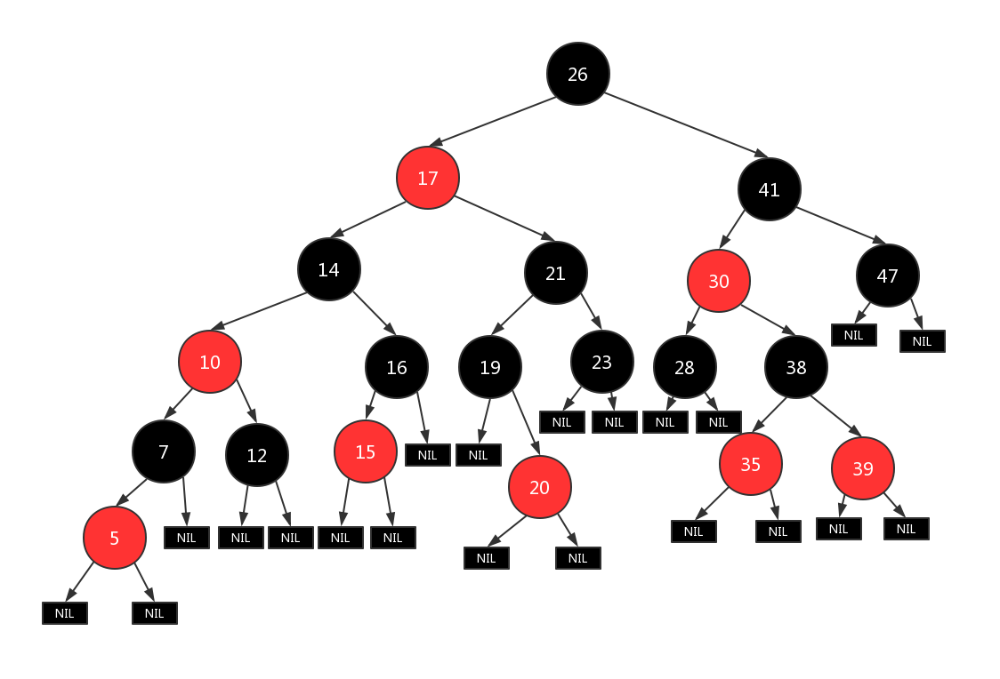

## 左旋和右旋

在自平衡二叉搜索树中,左旋和右旋是相当普遍而重要的操作.红黑树也利用旋转操作保持红黑树的5个基本特征.

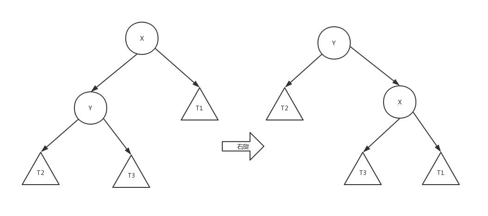

```js
/**
 * 节点右旋
 * @param {BinaryTreeNode} node
 */
function _rotateRight(node) {
  let nodeLeft = node._left;
  let nodeLeftRight = node._left._right;
  _setLeft(node, null);
  _replace(node, nodeLeft);
  _setRight(nodeLeft, node);
  _setLeft(node, nodeLeftRight);
  return nodeLeft;
}
```


```js
/**
 * 节点左旋
 * @param {BinaryTreeNode} node
 */
function _rotateLeft(node) {
  let nodeRight = node._right;
  let nodeRightLeft = node._right._left;
  _setRight(node, null);
  _replace(node, nodeRight);
  _setLeft(nodeRight, node);
  _setRight(node, nodeRightLeft);
  return nodeRight;
}
```

## 保持红黑树性质

恢复红黑树性质基本上是通过旋转和将颜色向上转移的方式进行的.无论新增和删除都会首先保证不违反红黑树性质5,因为这样的代价是很高的,需要经过复杂操作恢复,因此只会破坏性质1 2 4(性质3 很难破坏 --!)

然后通过将多余的红色向其他地方转移的方式恢复红黑树性质.

要么是向上转移,一直到根节点,然后将根节点的颜色直接设置为黑色即可(根节点的变化不会影响任何黑高度!),或者将多余的红色向对面子树转移(红色转移不会影响黑高度).

基本就是这两种思路.首先看看这两种思路的操作示意.

### 旋转:将颜色向兄弟子树转移

首先介绍如何通过颜色变化和旋转保持红黑树保持红黑树的性质.

* x : 当前节点
* w : 兄弟节点
* p : 父节点
* u : 叔叔节点

两种旋转是对称的,

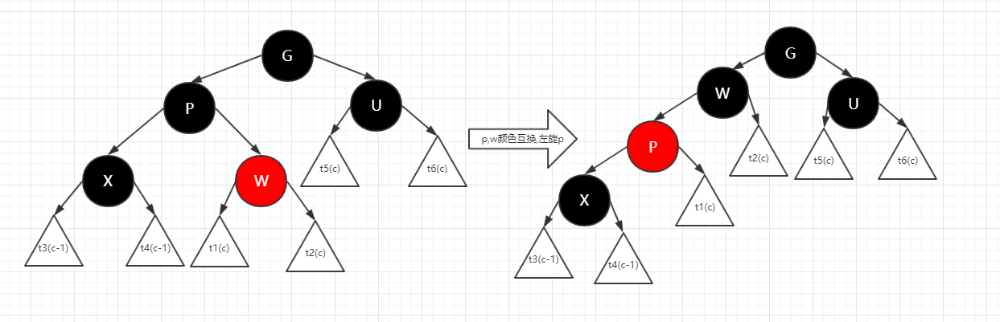

互换 w p 的颜色,然后再对p左旋,这相当于将w分支上的一个红色移动到x分支上,这样并不会破坏红黑树的属性.

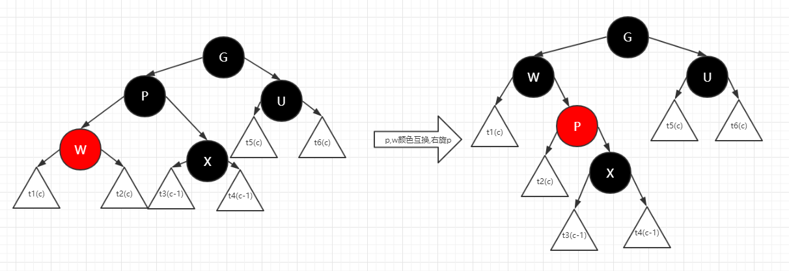

互换 w p 的颜色,然后再对p右旋,这相当于将w分支上的一个红色移动到x分支上,这样并不会破坏红黑树的属性.

### 抽取:将颜色向上转移

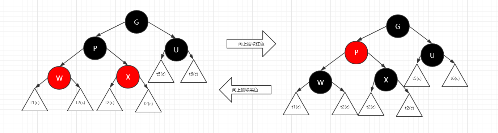

另一种方式是简单的变化颜色,有点像是将两个兄弟节点的颜色抽取到父节点,这样处理后依旧会保持红黑树的基本性质.

## 插入

插入一个节点的步骤简单可以概括为2步:

1. 将红黑树当作一颗二叉查找树,将节点插入.并将节点着色为红色(插入后可能会违背红黑树特征4,需要进行 `RB-INSERT-FIXUP`即步骤2)
2. 旋转树使之重新变成一颗红黑树(`RB-INSERT-FIXUP`)

```Pseudocode
//x : 迭代变量
//y : 插入节点的父节点
//z : 将要插入的节点
RB-INSERT(T, z)  
 y ← nil[T]                        // 新建节点"y",将y设为空节点.
 x ← root[T]                       // 设"红黑树T"的根节点为"x"
 while x ≠ nil[T]                  // 找出要插入的节点"z"在二叉树T中的位置"y"
     do y ← x
        if key[z] < key[x]  
           then x ← left[x]  
           else x ← right[x]  
 p[z] ← y                          // 设置 "z的父亲" 为 "y"
 if y = nil[T]
    then root[T] ← z               // Case 1:若y是空节点,则将z设为根
    else if key[z] < key[y]
            then left[y] ← z       // Case 2:若"z所包含的值" < "y所包含的值",则将z设为"y的左孩子"
            else right[y] ← z      // Case 3:("z所包含的值" >= "y所包含的值")将z设为"y的右孩子"
 left[z] ← nil[T]                  // z的左孩子设为空
 right[z] ← nil[T]                 // z的右孩子设为空.至此,已经完成将"节点z插入到二叉树"中了.
 color[z] ← RED                    // 将z着色为"红色"
 RB-INSERT-FIXUP(T, z)             // 通过RB-INSERT-FIXUP对红黑树的节点进行颜色修改以及旋转,让树T仍然保持红黑树特征
```

RB-INSERT-FIXUP 伪代码如下:

```Pseudocode
RB-INSERT-FIXUP(T, z)
while color[p[z]] = RED                                          // 若"当前节点(z)的父节点(p)是红色",则进行以下处理.
    do if p[z] = left[p[p[z]]]                                       // 若"z的父节点"是"z的祖父节点的左孩子",则进行以下处理.
          then y ← right[p[p[z]]]                                        // 将y设置为"z的叔叔节点(z的祖父节点的右孩子)"
               if color[y] = RED                                         // Case 1 : 叔叔是红色
                  then color[p[z]] ← BLACK                               // (1.1) 将"父节点"设为黑色.
                       color[y] ← BLACK                                  // (1.2) 将"叔叔节点"设为黑色.
                       color[p[p[z]]] ← RED                              // (1.3) 将"祖父节点"设为"红色".
                       z ← p[p[z]]                                       // (1.4) 将"祖父节点"设为"当前节点"
                  else
                        if z = right[p[z]]                               // Case 2 : 叔叔是黑色,且当前节点是右孩子,将Case2 通过旋转转换成 Case 3
                          then z ← p[z]                                  // (2.1) 将"父节点"设置为"当前节点".
                               LEFT-ROTATE(T, z)                         // (2.2) 左旋"当前节点",这样当前节点就变成了左孩子
                                                                         // Case 3 : 叔叔是黑色,且当前节点是左孩子.
                        color[p[z]] ← BLACK                              // (3.1) 将"父节点"设为"黑色"
                        color[p[p[z]]] ← RED                             // (3.2) 将"祖父节点"设为"红色".
                        RIGHT-ROTATE(T, p[p[z]])                         // (3.3) 以"祖父节点"为支点进行右旋.
       else (same as then clause with "right" and "left" exchanged)  // 若"z的父节点"是"z的祖父节点的右孩子",将上面的操作中"right"和"left"交换位置,然后依次执行.
color[root[T]] ← BLACK
```

首先明确的是新增一个红色节点,导致违反红黑树性质的节点只可能集中在**新增的节点和新增的节点的父节点**(*这两个都是红色*)上,因此当 红色节点`z`的父节点 `p` 为红色时,违反了红黑树性质.

只要将其中多余向上转移到根节点(然后将根节点设为黑色)或者将红色向另一个分支转移(还记得[旋转:将颜色向兄弟子树转移](#旋转:将颜色向兄弟子树转移)吗?),同时,如果向上转移导致上层不满足红黑树性质,只需要找到更新`当前节点z`循环调用即可.

共有3中Case,(实际是6种,但是根据左右孩子的对称,只介绍3种即可,另外3种对称处理),节点含义:

* z : 当前节点
* w : 兄弟节点
* p : 父节点
* u : 叔叔节点
* g : 祖父节点

### Insert Case 1

Case 1 可以简单概括为 当前节点为红色 父节点为红色 **叔叔节点为红色**.示意图如下.

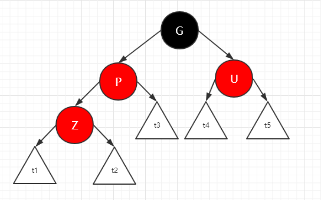

可以使用向上抽取一层红色的方式,将 父节点和叔叔节点设置为黑色 祖父节点设置为红色,这样,祖父节点一下就符合红黑树性质了.

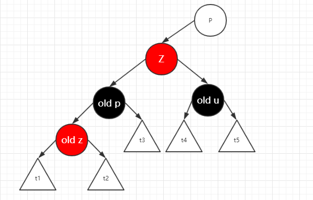

可能发生违反红黑性质的就变成了 **祖父节点和祖父节点的父节点**.将祖父节点设置为当前节点,祖父节点的父节点设置为p节点,递归调用 `RB-INSERT-FIXUP`,如果符合红黑树性质即可终止循环.

### Insert Case 3

先说 Case 3 再说 Case 2,因为下面可以看到 Case 2 可以通过操作转换成 Case 3.

Case 3 可以简单概括为 当前节点为红色 父节点为红色 **叔叔节点为黑色** 并且 **当前节点和父节点都是左孩子或者右孩子**(*zig zig 结构*).示意图如下.

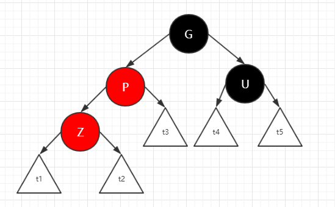

Case 3 本质是将父节点分支上的多余的一个红色"转移"到叔叔分支上.通过设置颜色和旋转即可实现.

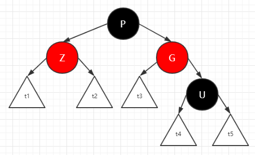

操作后`p`树上的所有节点都恢复了红黑树的性质,同时,`p`上层的红黑树属性都没有被修改,事实上,Case 3 操作后就可以直接结束循环.

### Insert Case 2

Case 2 概括为 当前节点为红色 父节点为红色 **叔叔节点为黑色** 并且 **当前节点是左孩子 父节点是右孩子,或者相反**(*zig zag 结构*).示意图如下.

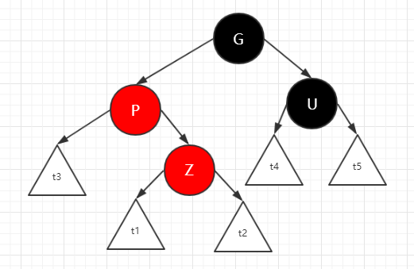

Case 2 是将 `zig zag` 结构变成 `zig zig` 结构,转变成 Case 3 处理.

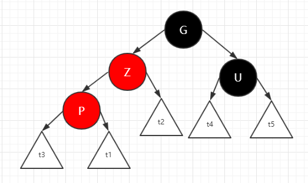

旋转后(或者旋转钱),交换 `p` `z` 指针,就变成了 Case 3.

## 删除

```Pseudocode
RB-DELETE(T, z)
// z: 需要删除的节点
// y: 实际删除的节点
// x: 实际删除y后替换y位置的节点
if left[z] = nil[T] or right[z] = nil[T]
   then y ← z                                  // 若"z的左孩子" 或 "z的右孩子"为空,则将"z"赋值给 "y";
   else y ← TREE-SUCCESSOR(z)                  // 否则,将"z的后继节点"赋值给 "y".
if left[y] ≠ nil[T]
   then x ← left[y]                            // 若"y的左孩子" 不为空,则将"y的左孩子" 赋值给 "x";
   else x ← right[y]                           // 否则,"y的右孩子" 赋值给 "x".
p[x] ← p[y]                                    // 将"y的父节点" 设置为 "x的父节点"
if p[y] = nil[T]
   then root[T] ← x                            // Case 1:若"y的父节点" 为空,则设置"x" 为 "根节点".
   else if y = left[p[y]]
           then left[p[y]] ← x                 // Case 2:若"y是它父节点的左孩子",则设置"x" 为 "y的父节点的左孩子"
           else right[p[y]] ← x                // Case 3:若"y是它父节点的右孩子",则设置"x" 为 "y的父节点的右孩子"
if y ≠ z
   then key[z] ← key[y]                        // 若"y的值" 赋值给 "z".注意:这里只拷贝z的值给y,而没有拷贝z的颜色
        copy y's satellite data into z
if color[y] = BLACK
   then RB-DELETE-FIXUP(T, x)                  // 若"y为黑节点",则调用
return y
```

当删除的节点是红节点时,删除后不会导致违反任何红黑性质.当删除的节点是黑节点时,可能违反

* 性质1:根节点不可以是红色
* 性质4:不能出现连续两个红色节点

```Pseudocode
RB-DELETE-FIXUP(T, x)
while x ≠ root[T] and color[x] = BLACK  
    do if x = left[p[x]]
          then w ← right[p[x]]                                         // 若 "x"是"它父节点的左孩子",则设置 "w"为"x兄弟节点"
              if color[w] = RED                                            //  Case 1 : x是"双重黑"节点,x的兄弟节点是红色.(此时x的父节点和x的兄弟节点的子节点都是黑节点).
                  then color[w] ← BLACK                                    //  (1.1) 将x的兄弟节点设为"黑色".
                          color[p[x]] ← RED                                //  (1.2) 将x的父节点设为"红色".
                          LEFT-ROTATE(T, p[x])                             //  (1.3) 对x的父节点进行左旋.
                          w ← right[p[x]]                                  //  (1.4) 左旋后,重新设置x的兄弟节点(原来的x的兄弟节点的左孩子).
              if color[left[w]] = BLACK and color[right[w]] = BLACK        //  Case 2 : x是"双重黑"节点,x的兄弟节点是黑色,x的兄弟节点的两个孩子都是黑色.
                  then color[w] ← RED                                      //  (2.1) 将x的兄弟节点设为"红色".x和w向上抽取一层黑色,w是单层黑所以变成红色,x是双重黑,因此变成单重黑
                        x ←  p[x]                                          //  (2.2) 设置"x的父节点"为"新的x节点".新的 x 节点就可能是 红黑节点或者双重黑节点.
                  else                                                     //  Case 3/4 : x是"双重黑"节点,x的兄弟节点是黑色;x的兄弟节点的至少有一个为红色.
                        if color[right[w]] = BLACK                         //  Case 3 : x是"双重黑"节点,x的兄弟节点是黑色;x的兄弟节点的右孩子是黑色的(左孩子是红色)
                            then color[left[w]] ← BLACK                    //  (3.1) 将x兄弟节点的左孩子设为"黑色".
                                color[w] ← RED                             //  (3.2) 将x兄弟节点设为"红色".
                                RIGHT-ROTATE(T, w)                         //  (3.3) 对x的兄弟节点进行右旋.
                                w ← right[p[x]]                            //  (3.4) 右旋后,重新设置x的兄弟节点.
                                                                           //  Case 4 : x是"双重黑"节点,x的兄弟节点是黑色;x的兄弟节点的右孩子是红色的(左孩子可能为黑色或者红色).
                        color[w] ← color[p[x]]                             //  (4.1) 将x父节点颜色 赋值给x的兄弟节点.
                        color[p[x]] ← BLACK                                //  (4.2) 将x父节点设为"黑色".
                        color[right[w]] ← BLACK                            //  (4.3) 将x兄弟节点的右子节设为"黑色".
                        LEFT-ROTATE(T, p[x])                               //  (4.4) 对x的父节点进行左旋.
                        x ← root[T]                                        //  (4.5) 设置"x"为"根节点".
      else (same as then clause with "right" and "left" exchanged)     // 若 "x"是"它父节点的右孩子",将上面的操作中"right"和"left"交换位置,然后依次执行.
color[x] ← BLACK // 红黑节点->黑 or 双重黑根节点->黑
```

删除的FixUp操作引入两个新的颜色: 红黑/双重黑 节点,仅当x 指向该节点时为这两种颜色,如果 x.color = BLACK 则 x 为双重黑节点, x.color = RED 则 x为红黑节点.

通过上述概念,不需要移除删除节点的所代表的一个黑高度,而是将这一个黑高度合并到x节点上,这样左树的黑高度并没有发生变化.仅需要通过循环将多余的这一个黑高度向上抽取,当x的兄弟节点是红色导致无法抽取黑色时,可以旋转产生x的新的兄弟黑色节点.

转移过程中,x可能指向下面三种节点

* (循环结束)红节点(该节点变成黑色)
* (循环结束)根节点(直接移除多余的黑色).
* 黑节点:变为新的双重黑x,继续向上转移.

转移过程中,可以通过旋转和改变节点颜色保持红黑树性质.

共有4中Case,(实际是8种,但是根据左右孩子的对称,只介绍4种即可,另外4种对称处理),介绍中节点含义:

* x : 当前节点
* w : 兄弟节点
* p : 父节点
* u : 叔叔节点
* g : 祖父节点

### Delete Case 2

先介绍 Case 2,因为 Case 1 最终可以转换成 Case 2,3,4中的一种

x是"双重黑"节点,*x的兄弟节点是黑色* **x的兄弟节点的两个孩子都是黑色.**

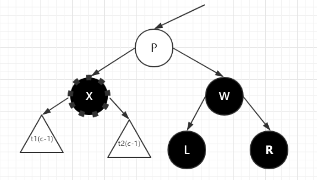

通过向上抽取 `x` 和 `w` 的黑色,`x` 变为黑色,`w` 变为红色, 同时更新`x`指向`p`(双重黑/红黑)

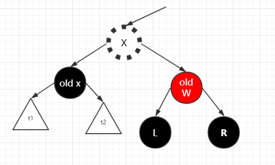

更新新的x后,如果是红黑,循环则可以结束了,x变为黑,如果是双重黑,需要继续调用 `RB-DELETE-FIXUP(T, x)` 处理新的x.

### Delete Case 4

先介绍 Case 4,因为 Case 3 最终可以转换成 Case 4

x是"双重黑"节点,*x的兄弟节点是黑色*;**x的兄弟节点的右孩子是红色的**(左孩子可能为黑色或者红色)

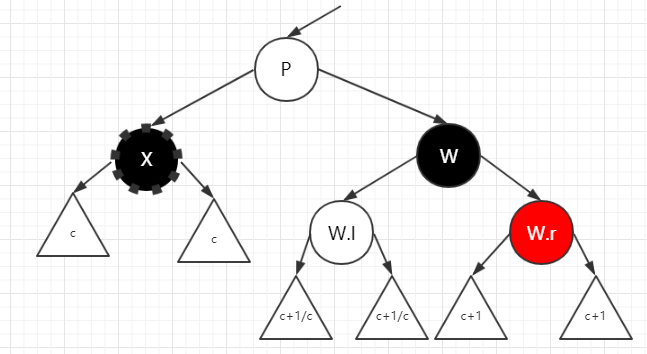

通过将`p`的颜色给`w`,然后设置`p`和 `w.r`为黑色颜色,然后左旋`p`.这时,红黑树的性质恢复了.


### Delete Case 3

x是"双重黑"节点,*x的兄弟节点是黑色*;**x的兄弟节点的右孩子是黑色的**(左孩子是红色)

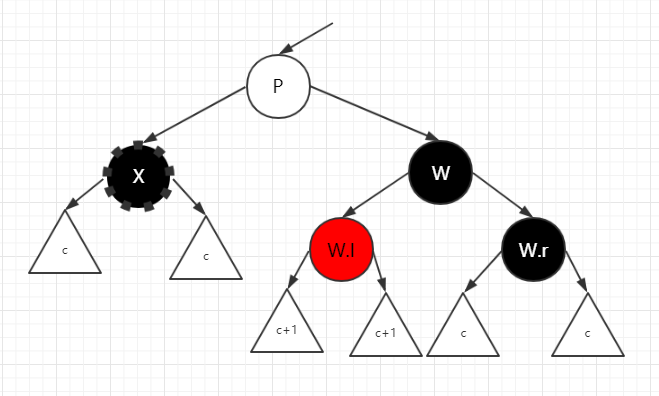

通过简单旋转和颜色交换,可以转换成 Case 4

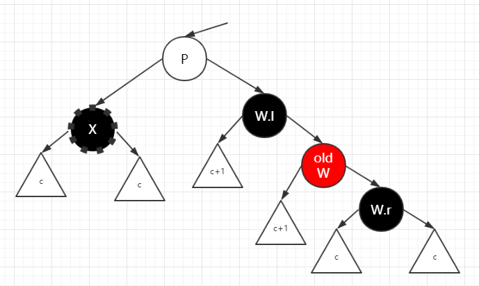

### Delete Case 1

x是"双重黑"节点,**x的兄弟节点是红色**.(此时x的父节点和x的兄弟节点的子节点必定都是黑节点).

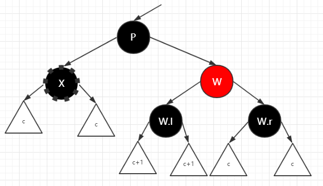

颜色交换和旋转后,将兄弟子树上的红色转换到当前子树上,然后更新 `x` 的兄弟 `w` ,观察可以看到,Case 1 可以转换成 Case 2 Case 3 or Case4

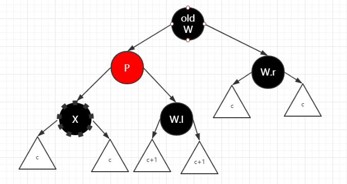

## 实现

[R-B Tree Source Code](../src/tree/RedBlackTree.js)