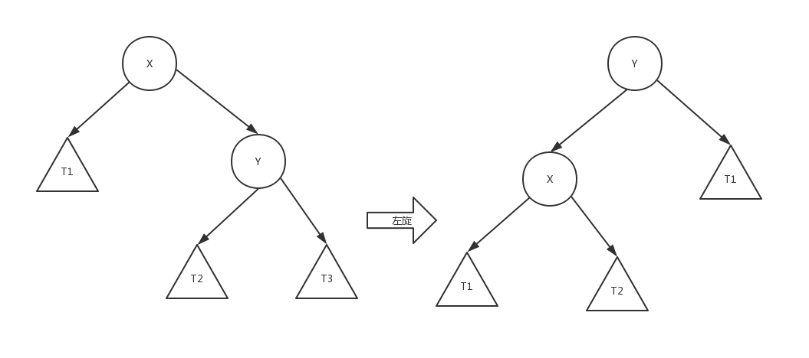

# 红黑树(R-B Tree)

R-B Tree,全称是Red-Black Tree,又称为"红黑树",它一种特殊的二叉查找树.红黑树的每个节点上都有存储位表示节点的颜色,可以是红(Red)或黑(Black).

1. 每个节点或红(Red)或黑(Black).
2. 根节点是黑色(Black)
3. 每个叶子节点是黑色(**这里叶子节点,是指为空的叶子节点**)
4. 如果一个节点是红色的,则它的子节点必须是黑色的.
5. 从一个节点到该节点的子孙节点的所有路径上包含相同数目的黑节点.(**确保没有一条路径会比其他路径长出俩倍.因而,红黑树是相对是接近平衡的二叉树.**)

红黑树示意图如下:


## 左旋和右旋

在自平衡二叉搜索树中,左旋和右旋是相当普遍而重要的操作.红黑树也利用旋转操作保持红黑树的5个基本特征.


```js
/**
 * 节点右旋
 * @param {BinaryTreeNode} node
 */
function _rotateRight(node) {
  let nodeLeft = node._left;
  let nodeLeftRight = node._left._right;
  _setLeft(node, null);
  _replace(node, nodeLeft);
  _setRight(nodeLeft, node);
  _setLeft(node, nodeLeftRight);
  return nodeLeft;
}
```



```js
/**
 * 节点左旋
 * @param {BinaryTreeNode} node
 */
function _rotateLeft(node) {
  let nodeRight = node._right;
  let nodeRightLeft = node._right._left;
  _setRight(node, null);
  _replace(node, nodeRight);
  _setLeft(nodeRight, node);
  _setRight(node, nodeRightLeft);
  return nodeRight;
}
```

## 插入

插入一个节点的步骤简单可以概括为2步:

1. 将红黑树当作一颗二叉查找树,将节点插入.并将节点着色为红色(插入后可能会违背红黑树特征4,需要进行 `RB-INSERT-FIXUP`即步骤2)
2. 旋转树使之重新变成一颗红黑树(`RB-INSERT-FIXUP`)

```Pseudocode
RB-INSERT(T, z)  
 y ← nil[T]                        // 新建节点"y",将y设为空节点.
 x ← root[T]                       // 设"红黑树T"的根节点为"x"
 while x ≠ nil[T]                  // 找出要插入的节点"z"在二叉树T中的位置"y"
     do y ← x
        if key[z] < key[x]  
           then x ← left[x]  
           else x ← right[x]  
 p[z] ← y                          // 设置 "z的父亲" 为 "y"
 if y = nil[T]
    then root[T] ← z               // Case 1:若y是空节点,则将z设为根
    else if key[z] < key[y]
            then left[y] ← z       // Case 2:若"z所包含的值" < "y所包含的值",则将z设为"y的左孩子"
            else right[y] ← z      // Case 3:("z所包含的值" >= "y所包含的值")将z设为"y的右孩子"
 left[z] ← nil[T]                  // z的左孩子设为空
 right[z] ← nil[T]                 // z的右孩子设为空.至此,已经完成将"节点z插入到二叉树"中了.
 color[z] ← RED                    // 将z着色为"红色"
 RB-INSERT-FIXUP(T, z)             // 通过RB-INSERT-FIXUP对红黑树的节点进行颜色修改以及旋转,让树T仍然保持红黑树特征
```

RB-INSERT-FIXUP 伪代码如下:

```Pseudocode
RB-INSERT-FIXUP(T, z)
while color[p[z]] = RED                                                  // 若"当前节点(z)的父节点(p)是红色",则进行以下处理.
    do if p[z] = left[p[p[z]]]                                           // 若"z的父节点"是"z的祖父节点的左孩子",则进行以下处理.
          then y ← right[p[p[z]]]                                        // 将y设置为"z的叔叔节点(z的祖父节点的右孩子)"
               if color[y] = RED                                         // Case 1条件:叔叔是红色
                  then color[p[z]] ← BLACK                    // Case 1  //  (1.1) 将"父节点"设为黑色.
                       color[y] ← BLACK                       // Case 1  //  (1.2) 将"叔叔节点"设为黑色.
                       color[p[p[z]]] ← RED                   // Case 1  //  (1.3) 将"祖父节点"设为"红色".
                       z ← p[p[z]]                            // Case 1  //  (1.4) 将"祖父节点"设为"当前节点"(红色节点)
                  else if z = right[p[z]]                                // Case 2条件:叔叔是黑色,且当前节点是右孩子,将Case2 通过旋转转换成 Case 3
                          then z ← p[z]                       // Case 2  //  (2.1) 将"父节点"设置为"当前节点".
                               LEFT-ROTATE(T, z)              // Case 2  //  (2.2) 左旋"当前节点",这样当前节点就变成了左孩子
                                                              // Case 3  // Case 3条件:叔叔是黑色,且当前节点是左孩子.
                          color[p[z]] ← BLACK                            //  (3.1) 将"父节点"设为"黑色"
                          color[p[p[z]]] ← RED                // Case 3  //  (3.2) 将"祖父节点"设为"红色".
                          RIGHT-ROTATE(T, p[p[z]])            // Case 3  //  (3.3) 以"祖父节点"为支点进行右旋.
       else (same as then clause with "right" and "left" exchanged)      // 若"z的父节点"是"z的祖父节点的右孩子",将上面的操作中"right"和"left"交换位置,然后依次执行.
color[root[T]] ← BLACK
```

上面三种情况(Case)处理问题的核心思路都是:将红色的节点移到根节点,然后,将根节点设为黑色

### Insert Case 1

### Insert Case 2

### Insert Case 3

## 删除

```Pseudocode
RB-DELETE(T, z)
if left[z] = nil[T] or right[z] = nil[T]
   then y ← z                                  // 若"z的左孩子" 或 "z的右孩子"为空,则将"z"赋值给 "y";
   else y ← TREE-SUCCESSOR(z)                  // 否则,将"z的后继节点"赋值给 "y".
if left[y] ≠ nil[T]
   then x ← left[y]                            // 若"y的左孩子" 不为空,则将"y的左孩子" 赋值给 "x";
   else x ← right[y]                           // 否则,"y的右孩子" 赋值给 "x".
p[x] ← p[y]                                    // 将"y的父节点" 设置为 "x的父节点"
if p[y] = nil[T]
   then root[T] ← x                            // Case 1:若"y的父节点" 为空,则设置"x" 为 "根节点".
   else if y = left[p[y]]
           then left[p[y]] ← x                 // Case 2:若"y是它父节点的左孩子",则设置"x" 为 "y的父节点的左孩子"
           else right[p[y]] ← x                // Case 3:若"y是它父节点的右孩子",则设置"x" 为 "y的父节点的右孩子"
if y ≠ z
   then key[z] ← key[y]                        // 若"y的值" 赋值给 "z".注意:这里只拷贝z的值给y,而没有拷贝z的颜色
        copy y's satellite data into z
if color[y] = BLACK
   then RB-DELETE-FIXUP(T, x)                  // 若"y为黑节点",则调用
return y
```

```Pseudocode
RB-DELETE-FIXUP(T, x)
while x ≠ root[T] and color[x] = BLACK  
    do if x = left[p[x]]
          then w ← right[p[x]]                                             // 若 "x"是"它父节点的左孩子",则设置 "w"为"x的叔叔"(即x为它父节点的右孩子)
          if color[w] = RED                                            // Case 1:x是"黑+黑"节点,x的兄弟节点是红色.(此时x的父节点和x的兄弟节点的子节点都是黑节点).
                  then color[w] ← BLACK                        //  Case 1  //   (01) 将x的兄弟节点设为"黑色".
                       color[p[x]] ← RED                       //  Case 1  //   (02) 将x的父节点设为"红色".
                       LEFT-ROTATE(T, p[x])                    //  Case 1  //   (03) 对x的父节点进行左旋.
                       w ← right[p[x]]                         //  Case 1  //   (04) 左旋后,重新设置x的兄弟节点.
               if color[left[w]] = BLACK and color[right[w]] = BLACK       // Case 2:x是"黑+黑"节点,x的兄弟节点是黑色,x的兄弟节点的两个孩子都是黑色.
                  then color[w] ← RED                          //  Case 2  //   (01) 将x的兄弟节点设为"红色".
                       x ←  p[x]                               //  Case 2  //   (02) 设置"x的父节点"为"新的x节点".
                  else if color[right[w]] = BLACK                          // Case 3:x是"黑+黑"节点,x的兄弟节点是黑色;x的兄弟节点的左孩子是红色,右孩子是黑色的.
                          then color[left[w]] ← BLACK          //  Case 3  //   (01) 将x兄弟节点的左孩子设为"黑色".
                               color[w] ← RED                  //  Case 3  //   (02) 将x兄弟节点设为"红色".
                               RIGHT-ROTATE(T, w)              //  Case 3  //   (03) 对x的兄弟节点进行右旋.
                               w ← right[p[x]]                 //  Case 3  //   (04) 右旋后,重新设置x的兄弟节点.
                        color[w] ← color[p[x]]                 //  Case 4  // Case 4:x是"黑+黑"节点,x的兄弟节点是黑色;x的兄弟节点的右孩子是红色的.(01) 将x父节点颜色 赋值给 x的兄弟节点.
                        color[p[x]] ← BLACK                    //  Case 4  //   (02) 将x父节点设为"黑色".
                        color[right[w]] ← BLACK                //  Case 4  //   (03) 将x兄弟节点的右子节设为"黑色".
                        LEFT-ROTATE(T, p[x])                   //  Case 4  //   (04) 对x的父节点进行左旋.
                        x ← root[T]                            //  Case 4  //   (05) 设置"x"为"根节点".
       else (same as then clause with "right" and "left" exchanged)        // 若 "x"是"它父节点的右孩子",将上面的操作中"right"和"left"交换位置,然后依次执行.
color[x] ← BLACK
```

### Delete Case 1

### Delete Case 2

### Delete Case 3

### Delete Case 4