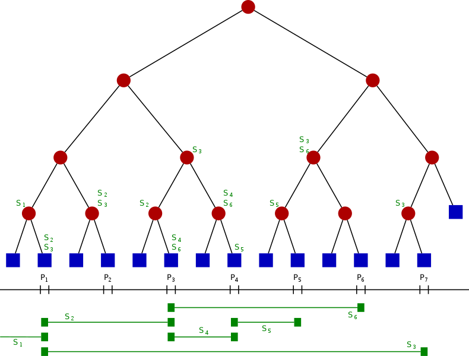

# Segment Tree

线段树是一种二叉树形数据结构,用以存储区间或线段,并且允许快速查询结构内包含某一点的所有区间

线段树有一个非常重要的性质,就是当父亲节点的区间为[x,y]时,左孩子的区间就必定为[x,(x+y)/2],右孩子的区间必定为[(x+y)/2+1,y]

* 其每一个叶节点，从左到右代表每个单位区间。
* 其内部节点代表的区间是其两个儿子代表的区间之联集。
* 每个节点(包含叶子)中有一个存储线段的数据结构