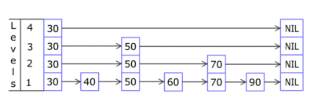

# 跳表

跳跃列表是一种数据结构,它允许快速查询一个有序连续元素的数据链表.


每个带有箭头的框表示一个指针, 而每行是一个稀疏子序列的链表,底部的编号框（黄色）表示有序的数据序列.查找从顶部最稀疏的子序列向下进行, 直至需要查找的元素在该层两个相邻的元素中间.

## promote

`promote`: 第 `i` 层中的元素按某个固定的概率 `p`（通常为 `1/2` 或 `1/4`）出现在第 `i+1` 层中

## 添加

新增一个节点时,首先插入到第1层中,然后进行`promote`操作

```伪代码
make all nodes level 1
j ← 1
while the number of nodes at level j > 1 do
  for each i'th node at level j do
    if i is odd
      if i is not the last node at level j
        randomly choose whether to promote it to level j+1
      else
        do not promote
      end if
    else if i is even and node i-1 was not promoted
      promote it to level j+1
    end if
  repeat
  j ← j + 1
repeat
```



## 跳表实现

[SkipList](../src/tree/SkipList.js)