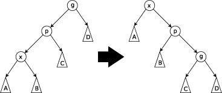

# 伸展树(Splay Tree)

伸展树(英语：Splay Tree)是一种能够自我平衡的二叉查找树,它能在均摊O(log n)的时间内完成基于伸展(Splay)操作的插入,查找,修改和删除操作,它是由丹尼尔·斯立特(Daniel Sleator)和罗伯特·塔扬在1985年发明的.

在伸展树上的一般操作都基于伸展操作: 假设想要对一个二叉查找树执行一系列的查找操作,假设想要对一个二叉查找树执行一系列的查找操作,为了使整个查找时间更小,被查频率高的那些条目就应当经常处于靠近树根的位置.

于是想到设计一个简单方法,在每次查找之后对树进行调整,把被查找的条目搬移到离树根近一些的地方.伸展树应运而生.伸展树是一种自调整形式的二叉查找树,它会沿着从某个节点到树根之间的路径,通过一系列的旋转把这个节点搬移到树根去.

它的优势在于不需要记录用于平衡树的冗余信息.

* 优点:  伸展树的自我平衡使其拥有良好的性能,因为频繁访问的节点会被移动到更靠近根节点,进而获得更快的访问速度.
  * 可靠的性能——它的平均效率不输于其他平衡树.
  * 存储所需的内存少——伸展树无需记录额外的什么值来维护树的信息,相对于其他平衡树,内存占用要小.
* 缺点: 伸展树最显著的缺点是它有可能会变成一条链.
  
  例如,在以非递减顺序访问全部n个之后就会出现这种情况.此时树的高度对应于最坏情况的时间效率,操作的实际时间效率可能很低.然而均摊的最坏情况是对数级的:O(log n).即使以"只读"方式(例如通过查找操作)访问伸展树,其结构也可能会发生变化.这使得伸展树在多线程环境下会变得很复杂.具体而言,如果允许多个线程同时执行查找操作,则需要额外的维护和操作.这也使得它们不适合在纯粹的函数式编程中普遍使用,尽管用于实现优先级队列的方式不多.

## 伸展(splay)

当一个节点x被访问过后,伸展操作会将x移动到根节点,为了进行伸展操作,我们会进行一系列的旋转,每次旋转会使x离根节点更近.

每次Splay操作由三个因素决定:

* x是其父节点p的左儿子还是右儿子
* p是否为根,如果不是
* p是其父节点g(x的祖父节点)的左儿子还是右儿子

重复执行 Splay 操作,直到x为根节点为止.

### Zig:当p为根节点时进行

1. `rotateRight(p)` 或者 `rotateLeft(p)`

### Zig-Zig:当p不为根节点且x和p都为左儿子或都为右儿子时进行

1. `rotateRight(g)` 或者 `rotateLeft(g)`
2. `rotateRight(p)` 或者 `rotateLeft(p)`

### Zig-Zag:当p不为根节点且x为左儿子而p为右儿子(或x为右儿子而p为左儿子)时进行

1. `rotateRight(p)` 或者 `rotateLeft(p)`
2. `rotateLeft(g)` 或者 `rotateRight(g)`

> 关于为什么循环进行 `Zig-Zig` or`Zig-Zag` 双旋转,而不是循环执行 `Zig` 单旋转?从下面两张图对比可以看到:
>
> 同样是将节点 `1`,如果 `Splay(1)` 单旋(只进行 `Zig`),Splay 完成后,树的结构并不非常平衡.
> 
>
> 但是如果执行双旋,树将会变得比较平衡.
>
> 

## 实现

[Splay Tree Source Code](../src/tree/SplayTree.js)
