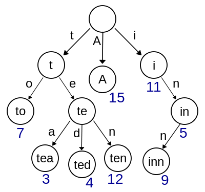
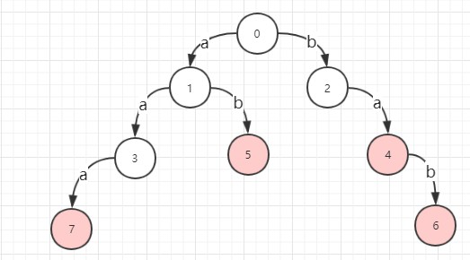
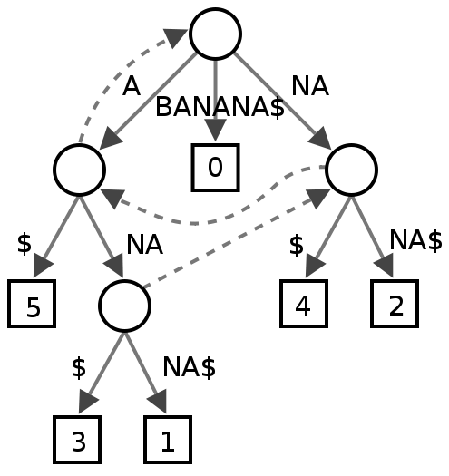

# 前缀树(Trie Tree)/后缀树(Suffix Tree)

## 前缀树(Trie Tree)

trie树常用于搜索提示.如当输入一个网址,可以自动搜索出可能的选择.当没有完全匹配的搜索结果,可以返回前缀最相似的可能.

### 构造

从根节点开始向下查找单词中对应的字符,如果不存在插入节点,再处理下一个字符.

### 查询

从根节点开始向下查找.

### 应用

可以取代 HashTable,性能上某些情况下好于HashTable(没有冲突,计算Hash耗时).但是多数情况下不如HashTable.

### 优化

对于中文或者其他类似的词句的检索,会导致Trie分支非常多,大量浪费
首先看一个Trie 的DFA:

如果有N个状态,并且字母表的大小是M,那么逻辑上就是一个N*M的数组,并且这个数组会比较稀疏,需要考虑压缩

#### Double-array Trie

使用了两个数组base和check来维护Trie树

`base`负责记录状态,用于状态转移,`check` 负责检查各个字符串是否是从同一个状态转移而来,当`check[i]`为负值时,表示此状态为字符串的结束

## 后缀树(Suffix Tree)

