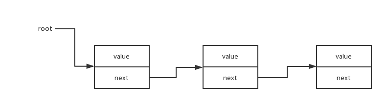

# 链表

一个有序数据集合,链表中的每个项都有一个指针指向下一个元素.



## 实现

```javascript
/**
 * LinkedListNode
 */
class LinkedListNode {

  /**
   * LinkedListNode 构造函数
   * @param {*} value
   */
  constructor(value) {
    this.value = value;
    this.next = null;
  }
}

/**
 * LinkedList
 */
class LinkedList {

  /**
   * 构造LinkedList
   */
  constructor() {
    this.dummyHead = new LinkedListNode();
  }

  /**
   * add value brefore head
   * @param {*} value
   */
  prepend(value) {
    let newNode = new LinkedListNode(value);
    newNode.next = this.dummyHead.next;
    this.dummyHead.next = newNode;
    if (this.tail === this.dummyHead) {
      this.tail = newNode;
    }
  }

  /**
   * add value at tail
   * @param {*} value
   */
  append(value) {
    let node = this.dummyHead;
    while (node.next) {
      node = node.next;
    }
    node.next = new LinkedListNode(value);
  }

  /**
   * remove first node
   */
  removeHead() {
    if (this.dummyHead.next) {
      let remove = this.dummyHead.next;
      this.dummyHead.next = remove.next;
      // NOTE: for memory leak
      remove.value = null;
      remove.next = null;
    }
  }

  /**
   * remove last node
   */
  removeTail() {
    let node = this.dummyHead;
    let pre = null;
    while (node.next) {
      pre = node;
      node = node.next;
    }
    if (pre) {
      pre.next = null;
      // NOTE: for memory leak
      node.value = null;
      node.next = null;
    }
  }

  /**
   * 输出数组
   */
  toArray() {
    let array = new Array();
    let node = this.dummyHead.next;
    while (node) {
      array.push(node.value);
      node = node.next;
    }
    return array;
  }
}

exports.LinkedList = LinkedList;
```

## 实践

### 访问链表的中间位置/倒数第n个节点

这是一类 tow pionts 问题.

使用两个指针 `fast 和 slow`,`fast`前进两步,`slow`前进一步,`fast` 到达最后的时后, `slow`指向中间节点

```javascript
/**
 * Definition for singly-linked list.
 * function ListNode(val) {
 *     this.val = val;
 *     this.next = null;
 * }
 */
/**
 * @param {ListNode} head
 * @return {ListNode}
 */
var middleNode = function (head) {
  let fast = slow = head;
  while (fast && fast.next) {
    [fast, slow] = [fast.next.next, slow.next];
  }
  return slow;
};
```